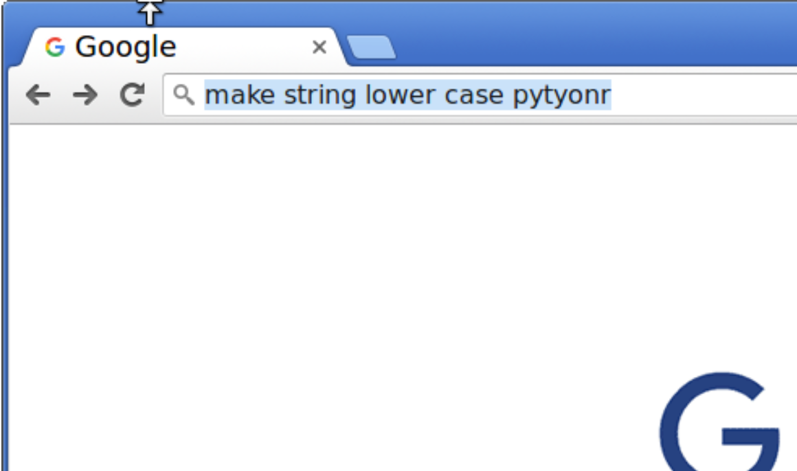
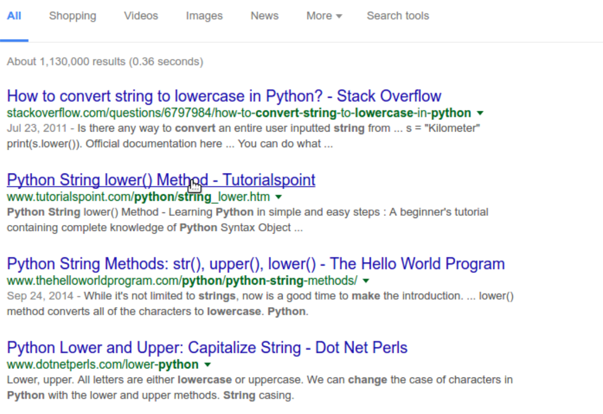
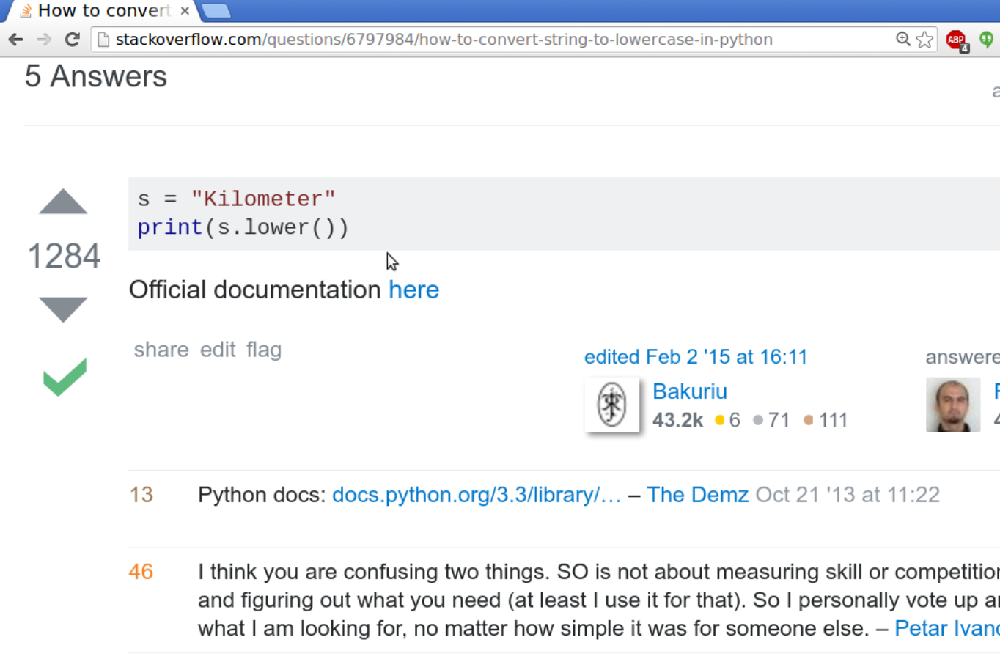

## Finding Answers with Google

Our weather app is working pretty well, but you may have noticed that it's case sensitive:

```
What is the weather like today? snowy
Bring your wooly muffler
What is the weather like today? SNOWY
I don't know what you should bring! I'm just a little program...
```

How could we fix our program to handle cases like this? We could add a bunch of new `elif` statements, like this:

```
[...]
elif weather == "snowy":
	print("Bring your wooly muffler")
elif weather == "SNOWY":
	print("Bring your wooly muffler")
[...]	
```

This is a lot of work, and it's a pretty ugly solution. If we wanted to add more cases to our program, we would have to write them in twice every time, and it still wouldn't fix inputs like `Snowy`. The best way to improve our program would be to convert the input to lower case before we send it to our `if/else` block.

### Googling for answers

Even if you're a super rad Python programmer, you're not going to remember every function name or how to do things you might not have touched in awhile. One thing programmers get very good at is googling for answers. In fact, this is arguably the most important skill in modern-day programming. So let's use Google to find out how to convert strings to lower case.

Let's try the search term `make string lower case Python`:

<br><br>

  

<br><br>

Notice that the first result is from a site called Stack Overflow. This is a questions and answers site for programmers that usually has strong answers to questions about Python.

<br><br>

  

<br><br>

On the Stack Overflow page, take a quick look at the question to make sure it's relevant to your problem. However, we need to scroll down to the answers to find what we're looking for:

<br><br>

  

<br><br>

### Implementing our answer

According to this answer, we can make a string lowercase by adding `.lower()` to the end of it, like this:

```
>>> "SNOWY".lower()
'snowy'
```

OK, that seems to work, even if we don't really know what's going on with that dot. Let's incorporate this transformation into our weather app:

```
while True:
    weather = input("What is the weather like today? ")
    weather = weather.lower()

    if weather == "sunny":
        print("Bring your shades")
    elif weather == "quit":
        break
    elif weather == "rainy":
        print("Bring your umbrella")
    elif weather == "snowy":
        print("Bring your wooly muffler")
    else:
        print("I don't know what you should bring! I'm just a little program...")
```		

This new script should handle any combination of upper or lowercase characters. The new second line sets the weather variable to a new value, `weather.lower()`, which is a lowercase version of the original input.

There's no shame in googling for answers! Error messages are especially useful to google when you run into them. Keep an eye out for Stack Overflow answers, as they tend to have useful examples. The [official Python documentation](https://docs.python.org/3/) will also frequently come up, but I would recommend avoiding it as a resource until you have more programming experience. It's a great resource, but the way information is presented can be confusing until you get the hang of reading documentation.
